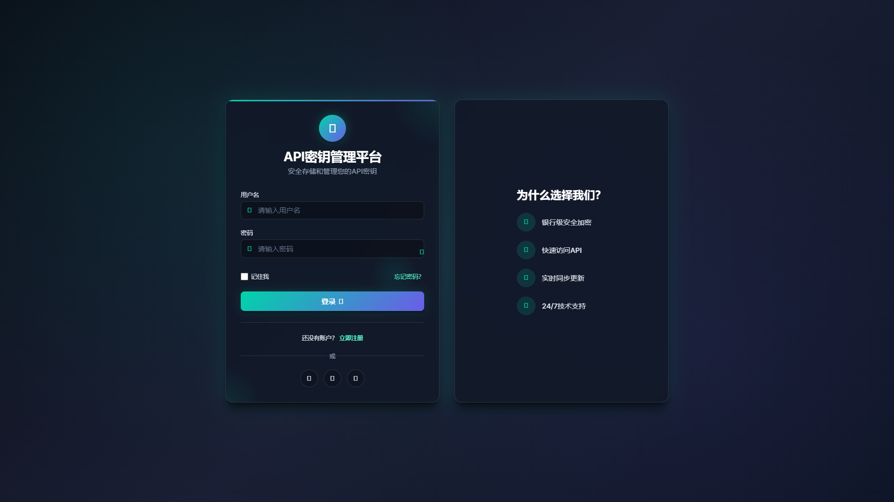

# API Key Manager

  

  <strong>🔐 一站式 API 密钥��管平台</strong>

  注册即用 · 安全加密 · 多端同步

---

## 产品介绍

**API Key Manager** 是一款专为 AI 开发者打造的 API 密钥托管服务。无需部署，注册即可使用。

你是否曾为以下问题烦恼？

- 🔑 OpenAI、Claude、Gemini、DeepSeek... 密钥散落各处
- 😰 明文存��在笔记、Excel 中，担心泄露
- 📋 每次配置新工具都要翻找复制
- 🤔 模型 ID 太长记不住
- 💻 换电脑后密钥要重新整理

**API Key Manager** 帮你一站式解决！

---

## 核心功能

### 🔐 安全加密存储

- **AES-256 加密**：所有密钥采用银行级加密存储
- **密钥预览**：只显示 `sk-abc...xyz`，永不明文
- **一键复制**：用完即走，不留痕迹

### 🏷️ 内置服务商配置

预设 10+ 主流 AI 平台，开箱即用：

| 服务商 | 支持功能 |
|--------|----------|
| OpenAI | ✅ 密钥存储 · 模型选择 · 连接测试 |
| Anthropic (Claude) | ✅ 密钥存储 · 模型选择 · 连接测试 |
| Google AI (Gemini) | ✅ 密钥存储 · 模型选择 · 连接测试 |
| DeepSeek | ✅ 密钥存储 · 模型选择 · 连接测试 |
| 智谱 AI | ✅ 密钥存储 · 模型选择 · 连接测试 |
| Moonshot | ✅ 密钥存储 · 模型选择 · 连接测试 |
| 百度文心 | ✅ 密钥存储 · 模型选择 |
| 阿里通义 | ✅ 密钥存储 · 模型选择 |
| Azure OpenAI | ✅ 密钥存储 · 模型选择 |
| 自定义服务商 | ✅ 支持 OpenAI 兼容格式 |

### 🤖 模型预设

- 预设各平台常用模型 ID
- 分类标签：对话、代码、长文本、多模态、经济
- 一键复制模型 ID，无需记忆

### ✅ 连接测试

- 添加密钥时一键验证有效性
- 实时反馈密钥状态

### 📊 使用统计

- Token 消耗概览
- 趋势图表分析
- 密钥活跃度排行

---

## 版本对比

| 功能 | 免费版 | Pro 版 |
|------|--------|--------|
| 密钥数量 | 10 个 | 无限 |
| 服务商数量 | 10+ | 10+ |
| 自定义服务商 | ❌ | ✅ |
| 使用统计 | 基础 | 详细 |
| 自动备份 | ❌ | 每日 |
| 多设备同步 | ❌ | ✅ |
| 密钥历史版本 | ❌ | 7 天 |
| 额度告警 | ❌ | 3 个 |

---

## 定价

### 免费版

**¥0 / 月**

- 最多 10 个密钥
- 基础功能
- 社区支持

[立即注册](#注册)

### Pro 版

**¥19 / 月**

- 无限密钥
- 全部功能
- 每日自动备份
- 多设备同步
- 优先支持

[立即订阅](#订阅)

---

## 快速开始

### 1. 注册账户

访问官网，使用邮箱或手机号注册

### 2. 添加密钥

选择服务商 → 输入密钥名称和 API Key → 测试连接 → 保存

### 3. 开始使用

随时查看、复制密钥，一键获取模型 ID

---

## 安全保障

| 安全措施 | 说明 |
|----------|------|
| 数据加密 | AES-256 加密存储 |
| 传输加密 | HTTPS 全站加密 |
| 密钥隔离 | 用户数据相互隔离 |
| 访问控制 | JWT 身份认证 |
| 定期备份 | 每日自动备份（Pro 版） |

---

## 常见问题

### Q: 密钥安全吗？

**A:** 我们采用 AES-256 加密存储所有密钥，密钥永不明文显示。即使是管理员也无法查看你的密钥原文。

### Q: 你们会使用我的 API 密钥吗？

**A:** 不会。我们只负责安全存储，不会调用你的密钥。测试连接功能由你的浏览器直接请求服务商 API。

### Q: 免费版够用吗？

**A:** 如果你管理不超过 10 个密钥，免费版完全够用。需要更多密钥或高级功能可升级 Pro 版。

### Q: 如何取消订阅？

**A:** 随时可在账户设置中取消订阅，已付费的服务期将继续有效。

### Q: 数据会丢失吗？

**A:** Pro 版提供每日自动备份，即使发生意外也能恢复数据。

---

## 技术支持

- 📧 邮箱：support@example.com
- 💬 微信：APIKeyManager
- 📝 提交反馈：[在线反馈](#)

---

## 版权声明

**© 2026 API Key Manager. All Rights Reserved.**

本服务为付费托管服务，未经授权不得复制、修改或用于商业目的。